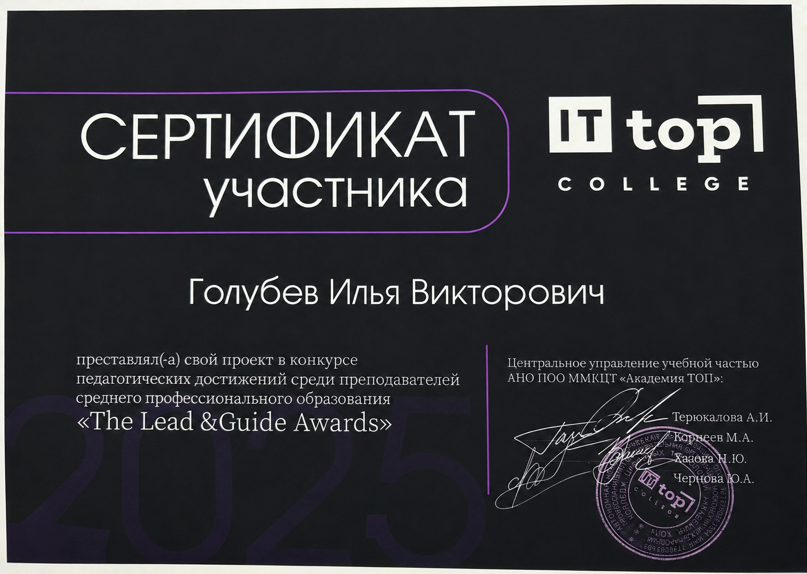

# FutureFit

FutureFit is a small Python desktop app that estimates a student's chance of success at IT TOP College.

The user rates four qualities:

- academic performance
- responsibility
- communication skills
- discipline

The app uses a probability formula to calculate the final percentage and gives a short explanation of the result.

## Project Story

Our college announced a competition for projects created by a teacher and a student together.

I have a very good relationship with my math teacher, who taught me higher mathematics, discrete mathematics, probability theory, and other subjects. We decided to take part and create this project together.

Our math and programming knowledge helped us build the idea, formula, and application. We also used AI a little during development.

There were many participants, but our project received recognition in the competition, and we were awarded certificates.

## Tech

- Python
- Probability theory
- Desktop GUI

## Project Files

- [Windows application](./FutureFit.exe)
- [Project presentation](./Project_On_Theory_Of_Probability.pptx)
- [Competition certificate](./certificate.png)

## Certificate

